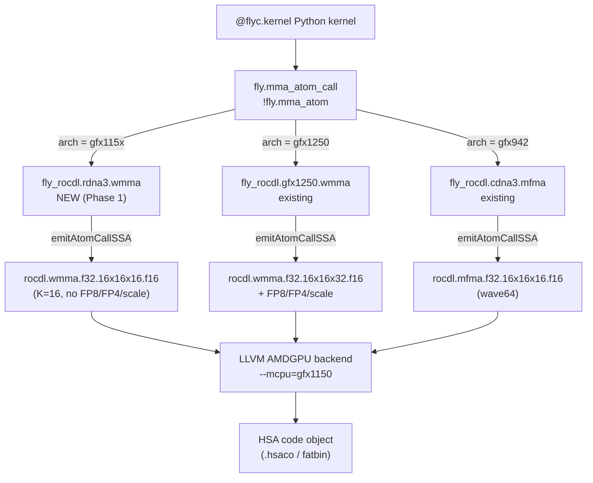

# RDNA 3.5 (gfx1150) Support for FlyDSL — PoC Summary

> One-page synthesis of [`01_isa_reference.md`](01_isa_reference.md),
> [`02_flydsl_backend_audit.md`](02_flydsl_backend_audit.md),
> [`03_python_layer_audit.md`](03_python_layer_audit.md), and
> [`04_intrinsic_coverage.md`](04_intrinsic_coverage.md). The full executable plan lives in
> `.cursor/plans/rdna35-flydsl-poc_*.plan.md`.

## TL;DR — Verdict

**PoC highly feasible, technical risk low.** RDNA 3.5 (gfx1150 / Strix Point) is structurally a
**proper subset** of FlyDSL's already-supported chips:

- **wave32** — already wired; `is_rdna_arch()` matches `gfx11*` → backend already passes
  `wave64=false`.
- **WMMA** — only 6 K=16 opcodes (F16, BF16, IU8, IU4); a strict subset of what gfx1201 supports,
  which is itself a subset of gfx1250.
- **Buffer / DS** — same V# layout as RDNA 3 / 4; FlyDSL's `_get_buffer_flags(arch)` already
  emits the right flag word.
- **No** TDM, transpose-loads, scaled WMMA, sparse, FP8/FP4, async copy, split barriers — all of
  these are gfx1250-exclusive and must be **stripped**, not implemented.

The single architectural detail that **prevents direct reuse** of `MmaOpGFX1250_WMMAType`:
**operand A/B duplication**. RDNA 3.5 uses LLVM `WMMA256bInsts` (lanes 0–15 must mirror lanes
16–31); gfx1250 uses `WMMA128bInsts` (no duplication). LLVM/AMDGPU codegen handles the duplication
automatically when emitting K=16 intrinsics, but the K-shape and intrinsic name differ. So we add
a new MMA atom that emits the K=16 forms.

## Hardware confirmed on dev box

| Property | Value |
|---|---|
| Chip | gfx1150 (Strix Point APU) |
| Marketing | AMD Radeon 890M Graphics |
| CPU | AMD Ryzen AI 9 HX 370 |
| Wavefront size | 32 |
| Compute Units | 16 |
| LDS / WGP | 128 KiB |
| LDS / work-group | 64 KiB max |
| ISA target | `amdgcn-amd-amdhsa--gfx1150` (also accepts `amdgcn-amd-amdhsa--gfx11-generic`) |

## Three phases of work

### Phase 0 — Smoke test (1–3 hours)

Goal: prove the toolchain works on this gfx1150 machine before committing to C++ changes.

1. `bash scripts/build_llvm.sh` (~30 min, builds upstream LLVM/MLIR with AMDGPU + nanobind
   bindings)
2. `bash scripts/build.sh && pip install -e .` (~5 min, builds FlyDSL C++ + bindings)
3. Relax `_requires_rdna4` in [`tests/kernels/test_rdna_gemm.py`](../../tests/kernels/test_rdna_gemm.py)
   from `gfx120` to also accept `gfx115`/`gfx110`
4. Run pytest on it + on portable wave-agnostic kernels (softmax, layernorm)

If this passes, we know:
- LLVM `gfx1150` codegen produces a working hsaco
- The K=16 WMMA intrinsics raw-emitted from
  [`kernels/rdna_f16_gemm.py`](../../kernels/rdna_f16_gemm.py) execute correctly
- Numerical correctness vs PyTorch reference holds on this hardware

### Phase 1 — Minimal PoC (1–2 days)

Goal: add a real `RDNA3` sub-target to FlyROCDL with one end-to-end atom-based GEMM.

1. **TableGen / C++**: new `MmaOpRDNA3_WMMA` type + `lib/Dialect/FlyROCDL/RDNA3/MmaAtom.cpp`
   emitting the 6 RDNA 3.5 K=16 WMMA intrinsics with strict `verify()` (refuse
   FP8/FP4/scale/K=32).
2. **Python binding**: `PyMmaOpRDNA3_WMMAType` + `WMMA_RDNA3(...)` factory; thin auto-dispatch
   `WMMA(...)` chooses gfx115*/gfx110* → RDNA3, else → GFX1250.
3. **`SMEM_CAPACITY_MAP`** entry for gfx1150/1151/1152/1153 = 65536.
4. **`default_f8_type()`** raises clearly on gfx11 (no FP8 hardware).
5. **FileCheck test**: `tests/mlir/Conversion/wmma_rdna3.mlir`.
6. **Layout-API kernel**: `kernels/rdna3_f16_gemm.py` with `WMMA_RDNA3` atom.
7. **End-to-end test**: `tests/kernels/test_rdna3_wmma_gemm.py` skip-unless gfx115*/gfx110*,
   compare against PyTorch.

### Phase 2 — Broader integration (1–2 weeks, optional)

Independent sub-tasks: portable kernel validation (softmax/layernorm/rmsnorm), optimised GEMM
with LDS double-buffer + sched_barrier, port `wmma_gemm_gfx1250.py` simplified to gfx1150,
rewrite `rdna_f16_gemm.py` from raw-intrinsic to atom-based, autotune validation, CI runner,
docs updates.

## Reference architecture diagram

## Risks and mitigations

| Risk | Mitigation |
|---|---|
| WMMA A/B duplication needs IR-level layout | Phase 0 verifies LLVM auto-handles it for K=16 form; if so we just publish a "logical" `getThrValLayout` and trust codegen. |
| Toolchain incompatibility on this machine | Phase 0 catches it before any code change. |
| `default_f8_type()` silent fall-through on gfx1150 | Phase 1 step explicitly raises. |
| Existing `rdna_f16_gemm.py` bypasses atom layer (raw intrinsics) | Phase 1 writes a new atom-based kernel; Phase 2 (option 4) ports the legacy one. |

## Decision log

- **Why a new `MmaOpRDNA3_WMMAType` rather than aliasing `MmaOpGFX1250_WMMAType`?** Because
  gfx1250 emits `wmma_*_16x16x32_*` (K=32) while gfx1150 only has K=16 — the intrinsic name and
  vector widths differ at the lowering level. Trying to alias would require runtime/compile-time
  forking inside the gfx1250 atom's `emitAtomCallSSA`, which is uglier than a dedicated atom.
- **Why no `CopyOpRDNA3*`?** The CDNA3 `CopyOpCDNA3BufferCopy` works as-is — the only gfx1150
  difference is the V# flag word, which is **already** handled in
  [`python/flydsl/expr/buffer_ops.py`](../../python/flydsl/expr/buffer_ops.py) via
  `_get_buffer_flags()` + `is_rdna_arch()`. We only need to skip
  `CopyOpCDNA3BufferCopyLDS` (relies on `raw.ptr.buffer.load.lds`, gfx9/10 only).
- **Why not also add `gfx1100`/`gfx1101` (RDNA 3.0)?** They share `WMMA256bInsts` so the same
  atom would work on them. Adding them is a one-line change in the auto-dispatch wrapper. We can
  do this in Phase 2 once Phase 1 is green on gfx1150.
